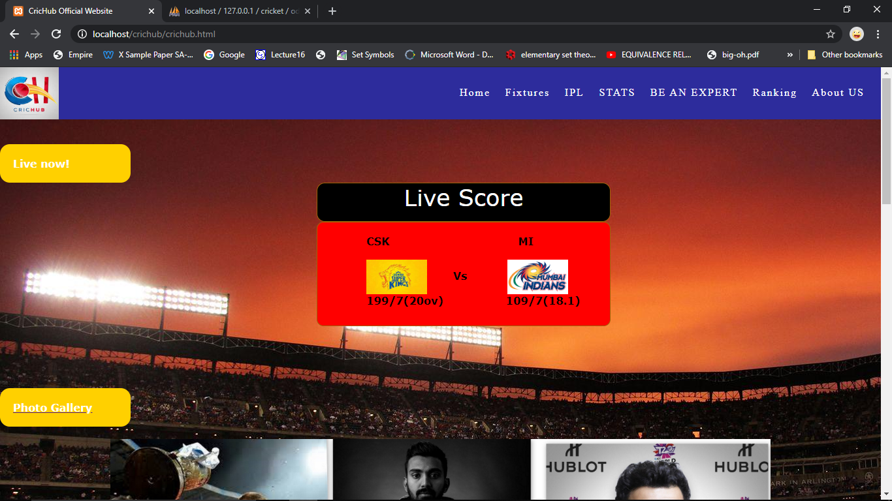

# CricHub
A  Website all about cricket
 
 # About The Project
 
The project has been named as CricHub Website.  
The goal of the project was to develop a fully functioning website.  
In this website section of cricket sport and section of entertainment is covered. In this website , one can browse things related to all about cricket.  
Viewing Cricket Scorecard, Cricket Picture Gallery, and browsing articles can be done on this website.  
User can view fixtures and can download fixtures in this website.  
User can watch Videos and become a critic, basically the one can given their comments about player and their performances.  
User can Sign Up to become a critic and then can login.  
Rankings of various cricket teams can also be viewed in this website.   
The frontend of the website has been created by using HTML,CSS and JavaScript . Further to link the website with the backend, PHP has been used. By actioning the xampp server , and connecting with localhost/phpmyadmin the website backend has been build up. 
 

# Screen Shots of the Project:-
  
.png) 
.png) 
.png) 
.png) 
.png) 
.png) 
.png) 
.png) 
.png) 
.png) 
.png) 
.png) 
.png) 
.png) 
.................................................................................................................................... 
# Used 
--> HTML  
--> CSS   
--> Java Script  
--> PHP  
.................................................................................................................................................. 
  
# Run
----> Imoprt the database file in your localhost , run the xampp . 
----> Run crichub.html file. 
---->Make sure , you have done the connection correctly with the localhost. 
(Put this folder in xampp/htdocs folder)

 
# Future Prospects

One thing for sure is to link the project with the API for cricket scoreboard, We are going through many tutorials to learn how to build API , and how functioning can be done through it.  
We will also try our best to include the fantasy cricket cricket for fans , that again requires API , so work would be done on that.  
The other things for the project prospects is welcomed by you, we will try our best to accomplish that. 
